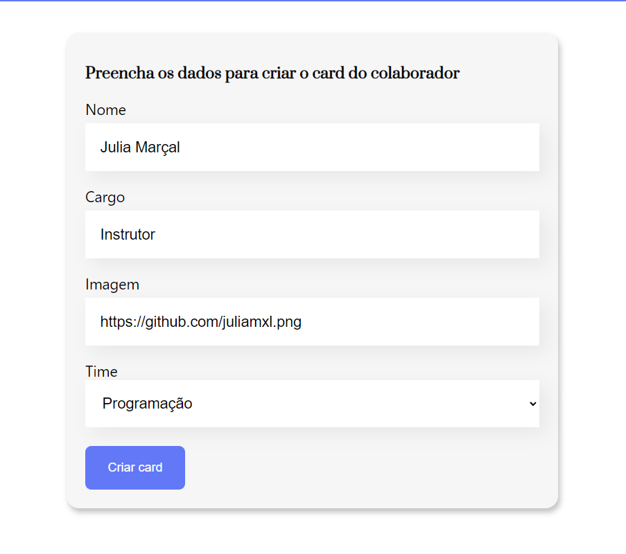

<h1 align="center"> Aprendendo React </h1>

Objetivo do projeto: criar um site interativo com React, quando o formulário for preenchido e enviado, deve ser criado um card do funcionário com imagem, nome, cargo e time.

  <a href="#-tecnologias">Tecnologias</a>&nbsp;&nbsp;&nbsp;|&nbsp;&nbsp;&nbsp;
  <a href="#-projeto">Projeto</a>

 

  
  

## 🚀 Tecnologias

Esse projeto foi desenvolvido com as seguintes tecnologias:

- HTML e CSS
- JavaScript e React

